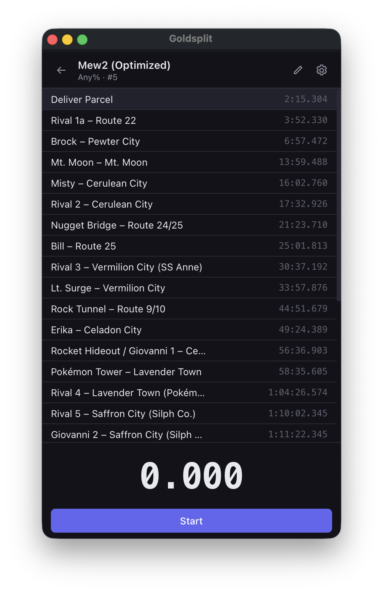
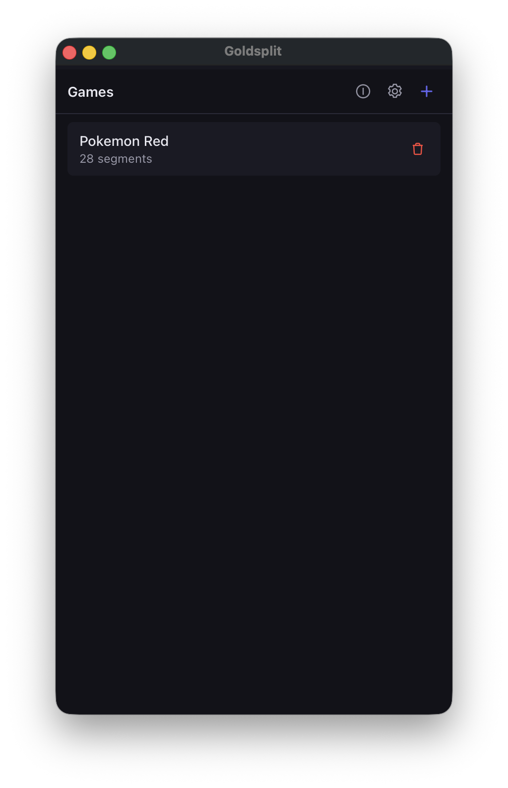
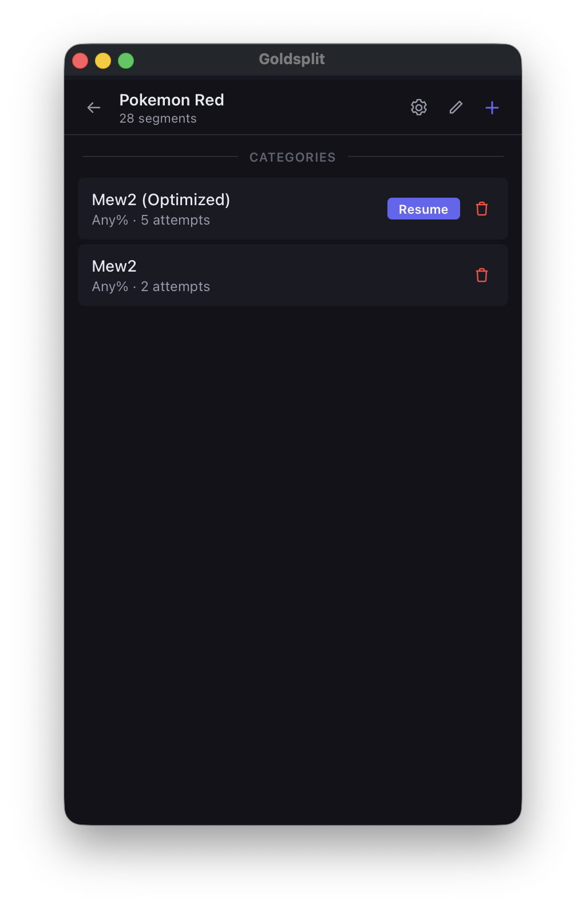
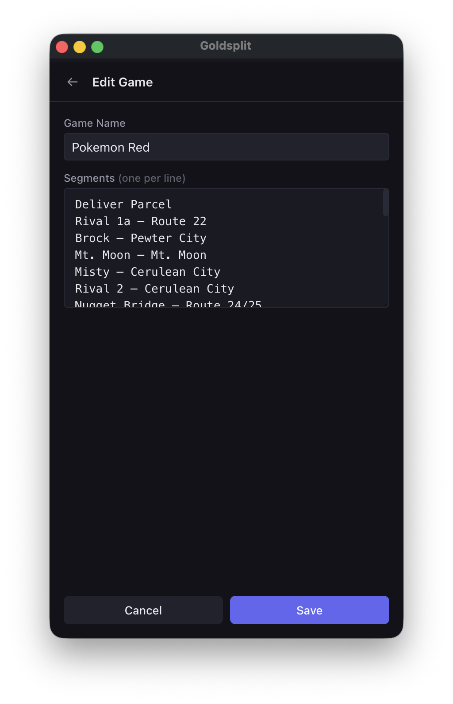
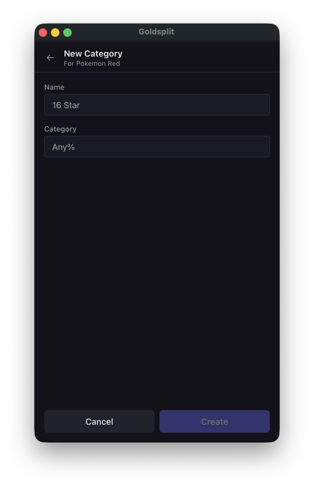
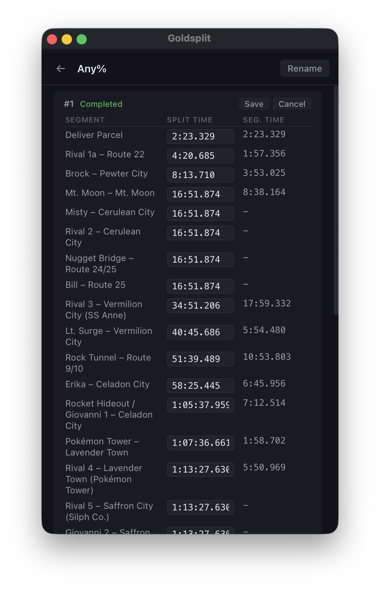
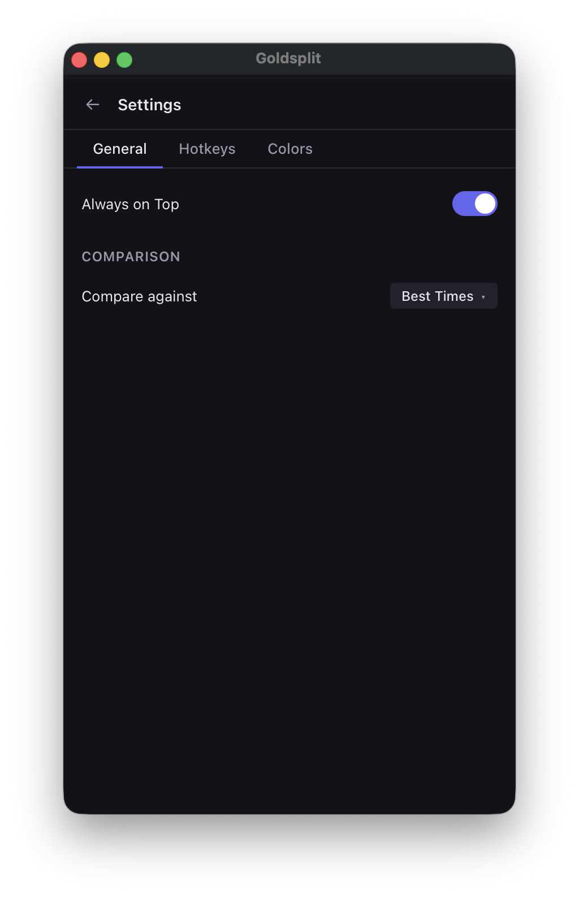
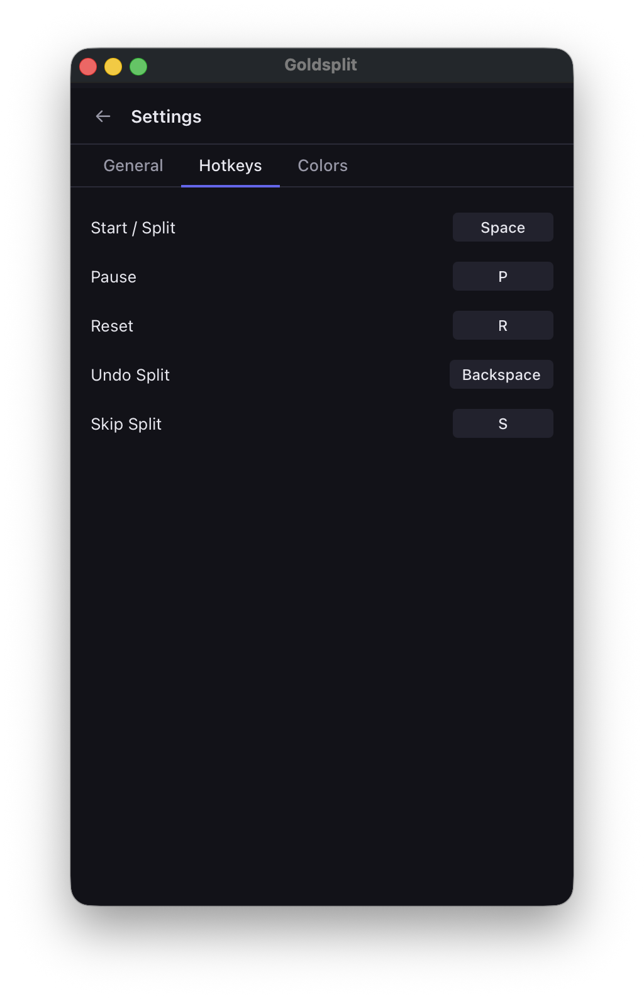
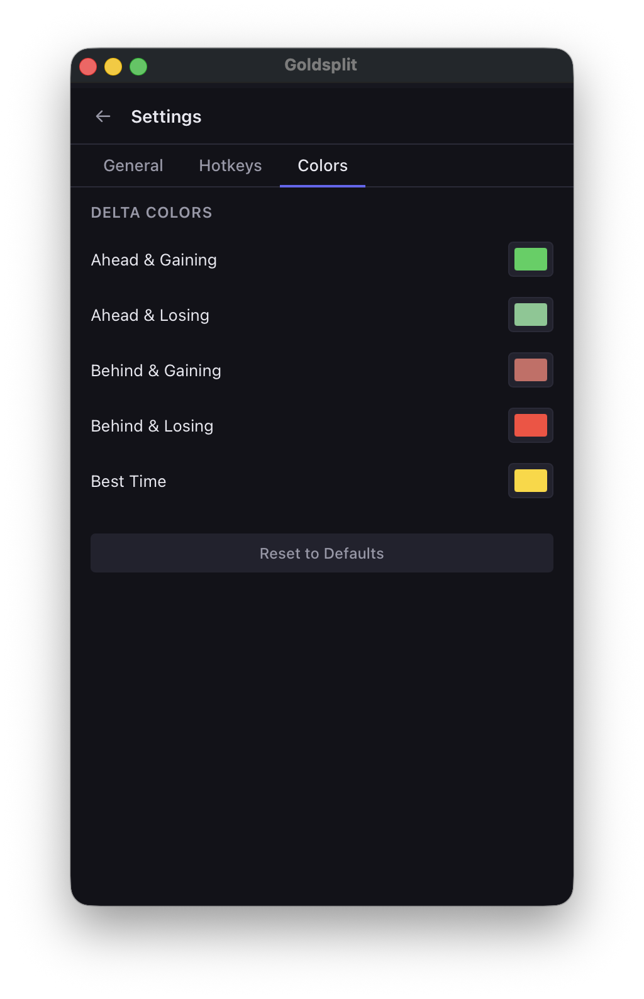
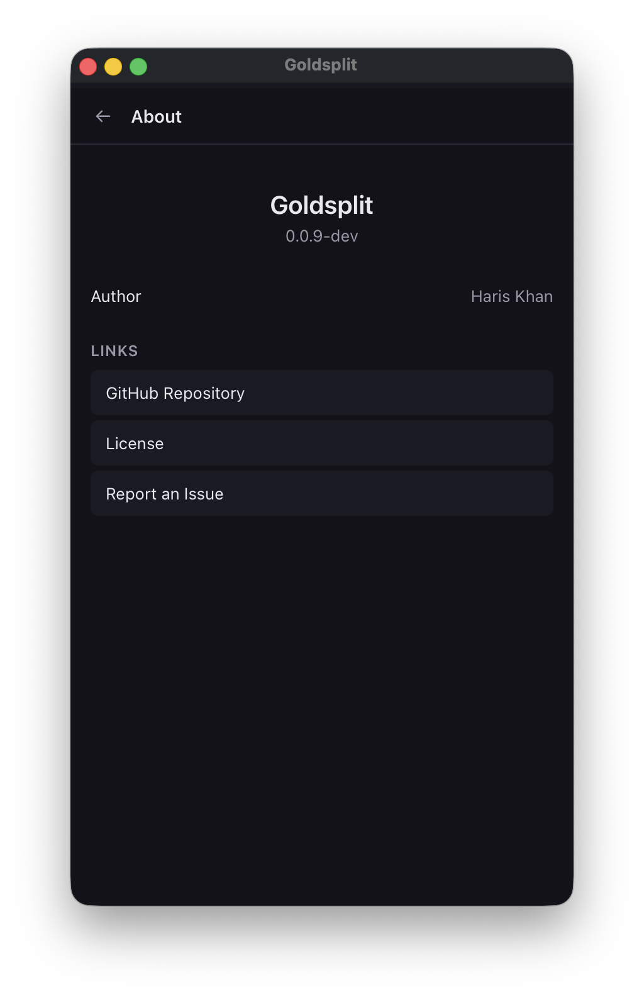

# Goldsplit

A lightweight speedrun timer for macOS, Windows, and Linux.

[](LICENSE)
[](https://github.com/tyrantkhan/goldsplit/releases)

<p align="center">
  
</p>

## Features

- Create games with custom segments
- Organize runs into named categories (e.g. Any%, 100%)
- Compare splits against personal best or best segments
- Sum of Best calculation using current run segments to fill gaps
- Pause, resume, undo split, and skip split
- Edit attempt times after a run
- Customizable delta colors (ahead/behind, gaining/losing)
- Configurable hotkeys
- Always-on-top mode
- Cross-platform — built with [Wails](https://wails.io) (Go + Svelte)

## Screenshots

<table>
  <tr>
    <td align="center"><br /><b>Games List</b></td>
    <td align="center"><br /><b>Categories & Resume</b></td>
    <td align="center"><br /><b>Edit Game</b></td>
  </tr>
  <tr>
    <td align="center"><br /><b>New Category</b></td>
    <td align="center"><br /><b>Attempt Editor</b></td>
    <td align="center"><br /><b>Settings — General</b></td>
  </tr>
  <tr>
    <td align="center"><br /><b>Settings — Hotkeys</b></td>
    <td align="center"><br /><b>Settings — Colors</b></td>
    <td align="center"><br /><b>About</b></td>
  </tr>
</table>

## Installation

Download the latest release for your platform from the [Releases](https://github.com/tyrantkhan/goldsplit/releases) page.

| Platform | File |
|----------|------|
| macOS    | `Goldsplit.app.zip` |
| Windows  | `Goldsplit-windows-amd64.exe` |
| Linux    | `goldsplit-linux-amd64` |

> **macOS note:** The binary is not signed. On first launch, macOS Gatekeeper will block it. To allow it, run:
> ```sh
> xattr -cr /Applications/Goldsplit.app
> ```
> Alternatively, you can [build from source](#building-from-source).

## Building from Source

### Prerequisites

- [Go](https://go.dev/) 1.25+
- [Node.js](https://nodejs.org/) 23+

> **Tip:** If you use [mise](https://mise.jdx.dev/), run `mise install` to set up Go, Node.js, and dev tools automatically.

Then install the Wails CLI:

```sh
make setup
```

**Linux only:** GTK and WebKit development libraries are required. See [Wails Linux prerequisites](https://wails.io/docs/gettingstarted/installation#platform-specific-dependencies).

### Build

```sh
git clone https://github.com/tyrantkhan/goldsplit.git
cd goldsplit
wails build
```

The built application will be in `build/bin/`.

## Development

Start the dev server with hot reload:

```sh
make dev
```

### Make Targets

| Target | Description |
|--------|-------------|
| `make setup` | Install Wails CLI and other Go tools |
| `make dev` | Start Wails dev server with hot reload |
| `make build` | Production build |
| `make lint` | Run golangci-lint (builds frontend first) |
| `make frontend-check` | Run svelte-check on frontend |
| `make test` | Run Go tests |
| `make ci` | Run lint + frontend-check + test |

### Project Structure

```
goldsplit/
├── internal/        # Go backend (domain logic, persistence)
│   ├── split/       # Domain types (Template, Attempts)
│   └── persist/     # JSON file persistence
├── frontend/        # Svelte 5 + TypeScript UI
│   └── src/
├── build/           # Wails build config and assets
└── Makefile
```

## Default Hotkeys

| Action      | Key         |
|-------------|-------------|
| Start/Split | `Space`     |
| Pause       | `P`         |
| Reset       | `R`         |
| Undo Split  | `Backspace` |
| Skip Split  | `S`         |

Hotkeys can be customized in Settings → Hotkeys.

## License

[MIT](LICENSE)
